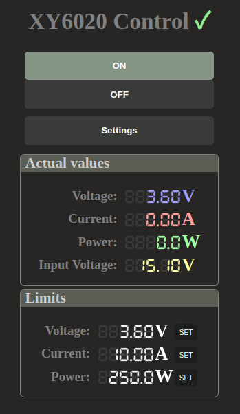

# XY6020 WiFi control interface

Controling XY6020 base modul via Modbus interface.

This project is written for Wemos D1 Pro module, 
but possible would run on other hardware.

Project ist under development.

## Features:

* Basic settings like max voltage, current, power via web interface.
* Electricity zero feed-in mode. Can be used together with any microinverters without power limiter.
You can connect XY6020 base PCB directly to the battery and control output power by reading electricity 
meter power values via mqtt. Only a single smart meter interface Tasmota SMI used with 
[volkszaehler.org](https://wiki.volkszaehler.org/hardware/controllers/ir-schreib-lesekopf-ttl-ausgang) hardware is currently supported.
Using this software with shelly 3em is possible but is not implemented yet.
* Working range hysteresis
To avoid deep discharging of the battery startup and cutoff voltage can be set.
* Planned but not implemented yet: Publishing values to mqtt topic for e. g. home assistant integration. 

## How to install

Install Visual Studio Code and Platformio plugin and open project.

   
## Usage
Wiring

    D1(GPIO4)  -> XY6020_RX 
    D2(GPIO5)  -> XY6020_TX 
    GND        -> XY6020_GND

-----------------

* Connect to XY6020 WiFi access point. 
* Navigate in browser to http://192.168.4.1 address and setup the board. 
* After reboot device is connected to new network.

-----------------

   
